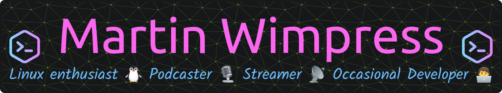

  

### Hi there 👋

I'm Martin (*also known as Wimpy*), an open-source enthusiast, frequent contributor and maker of things.

I lead [Ubuntu MATE](https://ubuntu-mate.org) 🧉 and I'm the author [Quickemu](https://github.com/quickemu-project)
and [deb-get](https://github.com/wimpysworld/deb-get) plus a [bunch of other projects](https://wimpysworld.com/projects/).

I run a small [Discord server for Wimpy's World](https://wimpysworld.io/discord) 💬 which serves as a community hub for most of my projects.
We are a friendly bunch, and all are welcome 🏳️‍🌈
I also run [live-coding streams on Twitch](https://twitch.tv/WimpysWorld) which are [archived on YouTube](https://youtube.com/WimpysWorld) 📺️

These awesome people sponsor me: [castrojo](https://github.com/castrojo) Thank you! ❤️
If you appreciate the work I do, then [please consider sponsoring me too](https://github.com/sponsors/flexiondotorg) 🤑

Curious what I've been working on recently?

<picture>
  <source media="(prefers-color-scheme: dark)" srcset="https://raw.githubusercontent.com/flexiondotorg/flexiondotorg/snake/github-contribution-grid-snake-dark.svg">
  <source media="(prefers-color-scheme: light)" srcset="https://raw.githubusercontent.com/flexiondotorg/flexiondotorg/snake/github-contribution-grid-snake.svg">
  
</picture>

#### 🚧 Latest contributions I made

- [flexiondotorg/flexiondotorg.github.io](https://github.com/flexiondotorg/flexiondotorg.github.io) - My personal blog (1 day ago)
- [flexiondotorg/github-stats-terminal-style](https://github.com/flexiondotorg/github-stats-terminal-style) (1 day ago)
- [wimpysworld/nix-config](https://github.com/wimpysworld/nix-config) - Wimpy&#39;s NixOS  &amp; Home Manager Configurations ❄️ (2 days ago)
- [quickemu-project/packaging](https://github.com/quickemu-project/packaging) - Quickemu &amp; Quickgui packaging (2 days ago)
- [quickemu-project/quickemu](https://github.com/quickemu-project/quickemu) - Quickly create and run optimised Windows, macOS and Linux desktop virtual machines. (2 days ago)

#### 🔨 Latest pull requests I published

- [feat: restore automated Windows .iso downloads from Microsoft servers](https://github.com/quickemu-project/quickemu/pull/836) on [quickemu-project/quickemu](https://github.com/quickemu-project/quickemu) (2 days ago)
- [Refactor the build system and update cmake to 3.22 minimum](https://github.com/wimpysworld/obs-studio-portable/pull/36) on [wimpysworld/obs-studio-portable](https://github.com/wimpysworld/obs-studio-portable) (3 weeks ago)
- [Make plugin lists a proper CSV file and parse it](https://github.com/wimpysworld/obs-studio-portable/pull/35) on [wimpysworld/obs-studio-portable](https://github.com/wimpysworld/obs-studio-portable) (3 weeks ago)
- [Add Countdown and Advanced Masks](https://github.com/wimpysworld/obs-studio-portable/pull/34) on [wimpysworld/obs-studio-portable](https://github.com/wimpysworld/obs-studio-portable) (3 weeks ago)
- [Assorted fixes and code clean up](https://github.com/wimpysworld/obs-studio-portable/pull/33) on [wimpysworld/obs-studio-portable](https://github.com/wimpysworld/obs-studio-portable) (3 weeks ago)

#### 📦️ Latest releases I contributed to

- [quickemu-project/quickemu](https://github.com/quickemu-project/quickemu) ([4.9.1](https://github.com/quickemu-project/quickemu/releases/tag/4.9.1), 2 days ago) - Quickly create and run optimised Windows, macOS and Linux desktop virtual machines.
- [wimpysworld/deb-get](https://github.com/wimpysworld/deb-get) ([0.4.0](https://github.com/wimpysworld/deb-get/releases/tag/0.4.0), 3 days ago) - apt-get functionality for .debs published in 3rd party repositories or via direct download 📦
- [occ-ai/obs-urlsource](https://github.com/occ-ai/obs-urlsource) ([0.2.1](https://github.com/occ-ai/obs-urlsource/releases/tag/0.2.1), 5 days ago) - OBS plugin to fetch data from a URL (API) or file, parse and display it live updating on scene
- [DeterminateSystems/nix-installer](https://github.com/DeterminateSystems/nix-installer) ([v0.14.0](https://github.com/DeterminateSystems/nix-installer/releases/tag/v0.14.0), 3 weeks ago) - Install Nix and flakes with the fast and reliable Determinate Nix Installer, with over a million installs.
- [wimpysworld/obs-dvd-screensaver](https://github.com/wimpysworld/obs-dvd-screensaver) ([0.0.2](https://github.com/wimpysworld/obs-dvd-screensaver/releases/tag/0.0.2), 3 weeks ago) - DVD screen saver for OBS Studio 📀

#### 🌱 Latest projects I created or started working on

- [Linux Matters](https://wimpysworld.com/projects/linux-matters/) (6 months ago)
- [machinespawn](https://wimpysworld.com/projects/machinespawn/) (1 year ago)
- [Linux Downtime](https://wimpysworld.com/projects/linux-downtime/) (2 years ago)
- [deb-get](https://wimpysworld.com/projects/deb-get/) (2 years ago)
- [Retro Home](https://wimpysworld.com/projects/retro-home/) (3 years ago)

#### 🎙️ Podcast

I co-present [Linux Matters podcast](https://linuxmatters.sh) with my friends [@popey](https://github.com/popey) and [@marxjohnson](https://github.com/marxjohnson).

Here's some recent episodes:

- [Mish Mash Mesh](https://linuxmatters.sh/15/) (1 week ago)
- [One Hundred Percent Colombian](https://linuxmatters.sh/14/) (3 weeks ago)
- [Um, Actually](https://linuxmatters.sh/13/) (1 month ago)
- [Steam Deck Emulation Done Right](https://linuxmatters.sh/12/) (1 month ago)
- [Using Two GPUs at Once](https://linuxmatters.sh/11/) (2 months ago)

#### 📺️ YouTube

- [NixOS | Packaging OBS Studio plugins and filters ❄️](https://www.youtube.com/watch?v=-QIhBJ11ZTM) (6 months ago)
- [Ubuntu | Final release process for Ubuntu MATE 23.04 🧉](https://www.youtube.com/watch?v=mNJzcJiaCCM) (6 months ago)
- [NixOS | Planning OBS Studio Flaking Loaded for NixOS ❄️](https://www.youtube.com/watch?v=sB-r0im0Mr8) (7 months ago)
- [NixOS | Planning my NixOS ❄️ device future 🔮](https://www.youtube.com/watch?v=v9GM8k9Aa7k) (7 months ago)
- [Linux | Preparing a new release of Quickemu and wrangling some Bash 🐚](https://www.youtube.com/watch?v=No1G-AxYHpY) (9 months ago)

#### ✍️ Blog

- [Install ZeroTier on Steam Deck](https://wimpysworld.com/posts/install-zerotier-on-steamdeck/) (2 months ago)
- [Steam Box vs Steam Deck](https://wimpysworld.com/posts/steambox-vs-steamdeck/) (6 months ago)
- [Flash Stadia Controller Bluetooth Firmware on Linux](https://wimpysworld.com/posts/flash-stadia-controller-bluetooth-firmware-on-linux/) (6 months ago)
- [Why I chose the ThinkPad Z13 Gen1 as my Linux laptop](https://wimpysworld.com/posts/why-i-chose-the-thinkpad-z13-as-my-linux-laptop/) (6 months ago)
- [Creating Production-Ready Containers - Advanced Techniques](https://wimpysworld.com/posts/creating-production-ready-containers-advanced-techniques/) (2 years ago)

